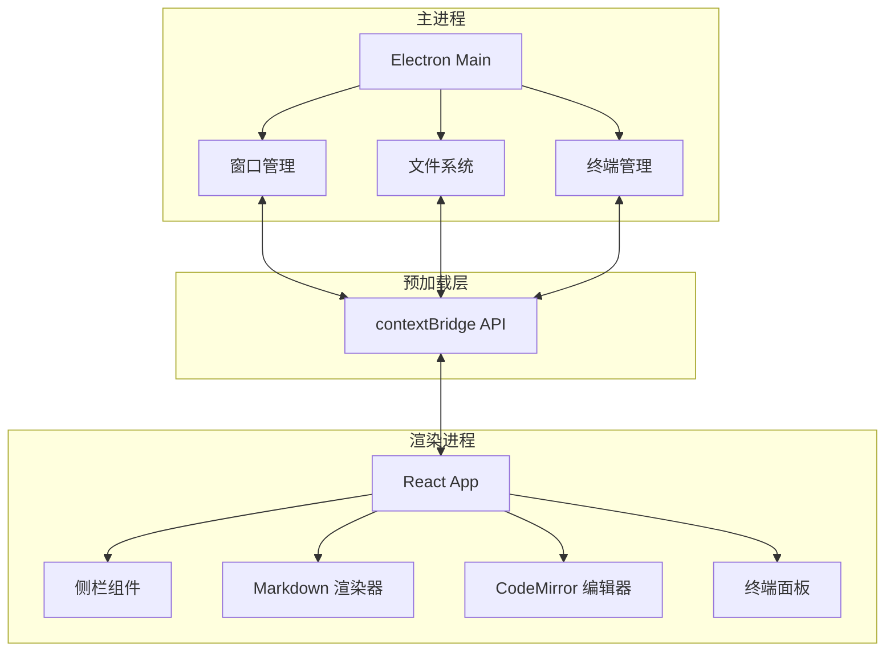
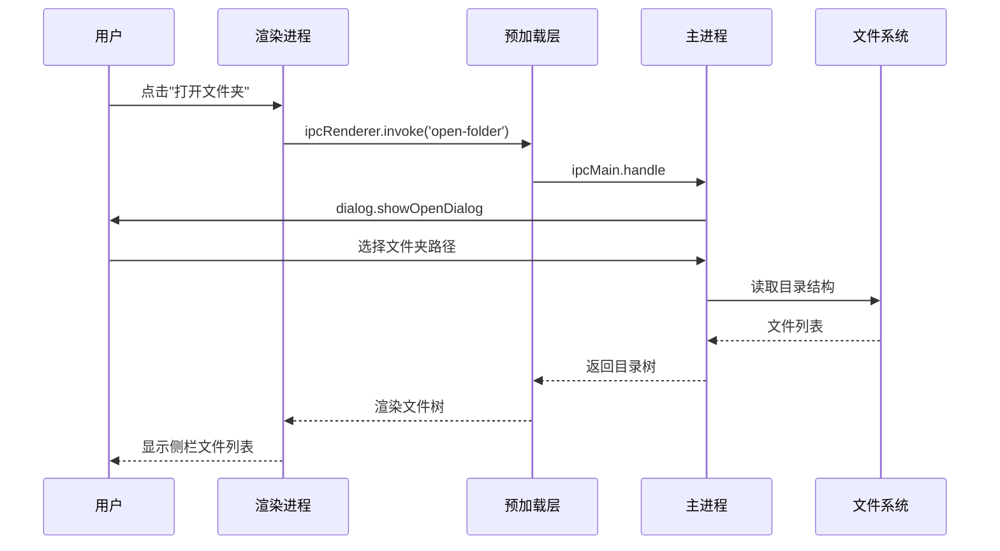
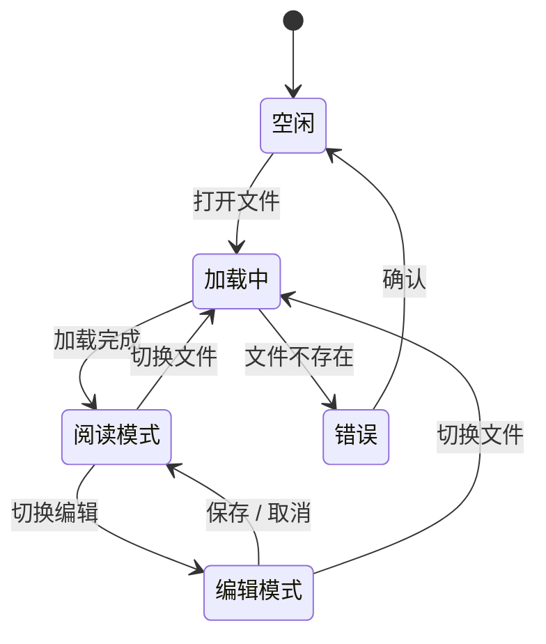
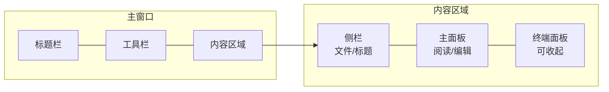
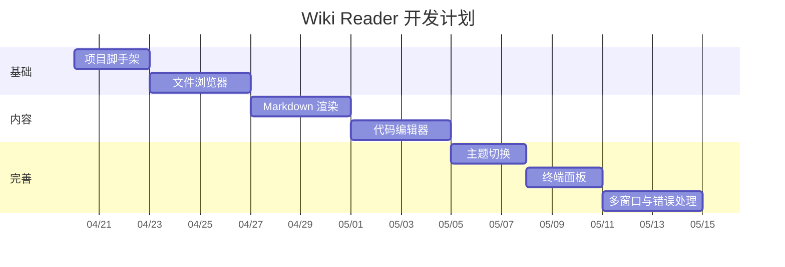
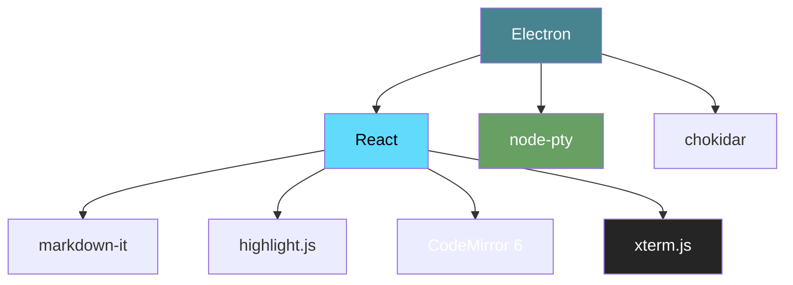
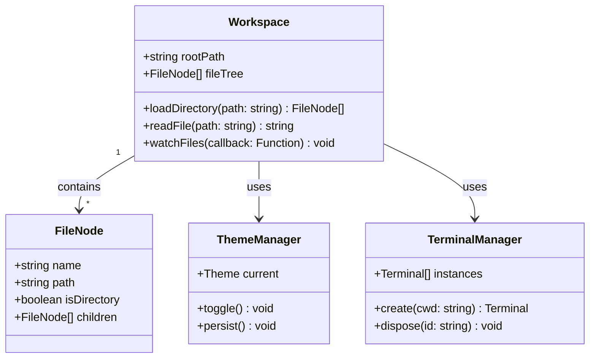
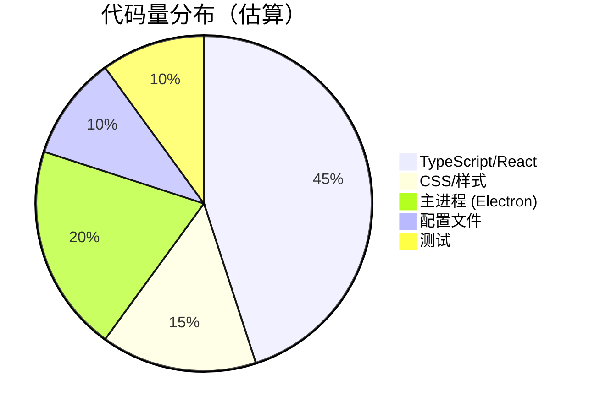

# 架构与流程图

本文档使用 Mermaid 图表展示 Wiki Reader 的架构设计，并演示各种 Mermaid 图表类型。

相关文档：
- [代码示例](code-examples.md) — 各语言代码高亮
- [高级排版](guide/advanced.md) — 表格与数学公式

## 系统架构

## 文件打开流程

## 状态管理

## 用户界面布局

## 开发阶段甘特图

## 技术依赖关系

## 类图

## 饼图

---

*上一篇：[代码示例](code-examples.md) | 下一篇：[图片引用](guide/images.md)*
